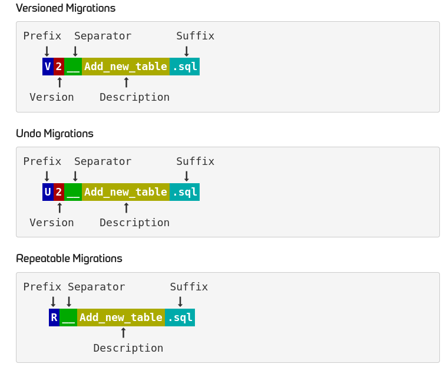
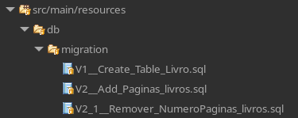
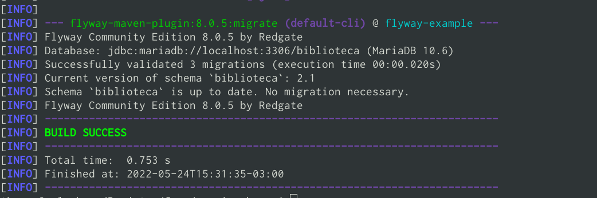
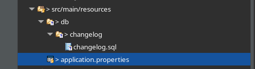
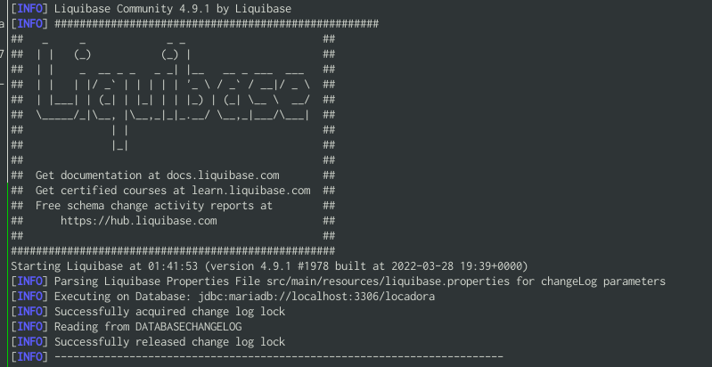

# Versionamento de banco de dados na linguagem Java {#versionamento}

O versionamento de banco de dados em aplicações e importante para manter ordem e organização
nos Scripts SQL que são executado no banco de dados. Assim, funcionando como um versionador desses
scripts.
Facilitando a sincronização da versão do banco de dados com a versão da aplicação, informar quais scirpts
foram executados, automatizar a execução dos scripts, criar banco de dados do zero (caso necessário) e
permite criar rollbacks de mudanças de banco de dados.

## 1. Ferramentas:

Foi feito dois projetos, que foi utilizado os seguintes versionadores:
	
1. Documentação do Flyway: [docs](https://flywaydb.org/documentation/)
2. Documentação do LiquiBase: [docs](https://docs.liquibase.com/home.html)

### 2. Visão Geral do Flyway:
	
O Flyway e usado em aplicações Java, disponível para gerenciadores de pacote/dependencia como maven e glade.
Possui também possui versão CLI (Command Line).
Sendo possivel fazer sincronização no servidor, localmente, etc.

O Flyway basicamente, vocẽ escreve suas DDLs e MMLs em determinada pasta com determinado nomeclatura, assim o ele
executa esses escripts criando uma tabela com essas informações, sendo: Qual script rodou, seu checksum, data e horario de execução e 
estado da execução. Criando um histórico das versões que foram executadas.
Cada novo arquivo e uma nova versão, independentimente do comando que será feito.

Os scripts devem estar em determinada pasta e com as nomeclaturas:



### 2.1. Tipos de migrations

	Existem duas formas de migrations: Regular e desfazer (undo).
	As regulares sao feitas no arquivos de que comecem com V e R, ja de desfazer e no arquivo U (disponivel apenas em versoes do Flyway Teams ou Enterprise Edition).

### 2.2. Executanto migrations:

O Flyway pode ser executado pela sua aplicacao (caso queira) ou pela linha de comando (instalando ele ou usando como plugin no maven)


Para o plugin o maven deve executar:

```console
$ mvn flyway:migrate -Dflyway.configFiles=flywayConfig.conf
```

Para executar com CLI:

```console
$ flyway migrate
```

Com o comando acima, sera executado as migrations que foram definidas nos arquivos, e sera executado em ordem das versoes.

__IMPORTANTE:__  Quando se criar um versao de arquivo V1 ou U1, nao se deve mais modificar
Para fazer uma nova modificacao sera necessario criar um nova veersao.

---

### 3. Usando Flyway com Spring Boot com JPA
	
	1. Para usar com Spring basta adicionar a dependencia no maven e o plugin (opcional) abaixo:
	
```xml
	<dependencies>
		...
		<dependency>
			<groupId>org.flywaydb</groupId>
			<artifactId>flyway-core</artifactId>
		</dependency>
	</dependencies>
	<build>
		<plugins>
			...
			<plugin>
				<groupId>org.flywaydb</groupId>
				<artifactId>flyway-maven-plugin</artifactId>
			</plugin>
		</plugins>
	</build>
```

__Observacao:__  A vantagem de usar o plugin e que nao e necessario rodar a aplicacao toda para executar migrations.

	2. Faca as configuracoes convesionais de banco de dados do spring com JPA. Example no arquivo application.propeties:
	
```properties
spring.datasource.url=jdbc:mariadb://localhost:3306/seubancodedados
spring.datasource.username=user
spring.datasource.password=user
spring.datasource.driver-class-name=org.mariadb.jdbc.Driver
```

	3. Criar as migrations na pasta resources/db/migration conforme nomeclaturas mencionadas.



	4. Executar a aplicacao spring ou usar o plugin na linha de comando. (conforme mencionado na secao 2.2)
	


### 4. Comandos do Flyway:

1. migrate - executa os scripts que existem. Tambem faz validacao, se alguma versao foi modificada.
2. validate - valida se alguma arquivo que ja foi migrado foi modificado e se existe migracao a ser feita.
3. info - exibe as informacoes das migracoes ja realizadas. 
4. clean - limpa todo o banco de dados.
5. repair - repara a tabela de historico


---

## 5. Visao geral LiquiBase:

O LiquidBase suporta nao somente arquivos SQL, mas tambem YAML, XML;
Usando o conceito de changelog e changeset, podemos definir as versoes das migracoes.
Ele pode ser executado com plugin no Maven/Glade ou instalado na maquina via linha de comando.
Tem suporte tambem com NoSQL.
Ele e OpenSource, e creio que o principal diferente e pela facilidade de fazer as migracoes, pois e apenas um arquivo,
e sendo necessario colocar o nome do autor e um Id para criar um nova mudanca. 
Quando houver conflito, e facil resolver com CVS como Git.

Para ver um quadro mais completo de diferencas: [link de comparativos](https://www.liquibase.com/liquibase-vs-flyway)


### 5.1. Usando LiquiBase com Spring Boot:

Primeiramente, segue o link da documentacao: [Usando liquiBase com Spring Boot + Maven](https://docs.liquibase.com/tools-integrations/springboot/using-springboot-with-maven.html)

1. Adicionar a dependencia do liquiBase:

```xml
	<dependencies>
		...
       <dependency>
                 <groupId>org.liquibase</groupId> 
                 <artifactId>liquibase-core</artifactId>
       </dependency>
	</dependencies>

		<build>
		<plugins>
			...
			<plugin>
				<groupId>org.liquibase</groupId>
				<artifactId>liquibase-maven-plugin</artifactId>
				<configuration>
					<propertyFile>src/main/resources/liquibase.properties</propertyFile>
					<changeLogFile>/src/main/resources/db/changelog/changelog.sql</changeLogFile>
				</configuration>
			</plugin>
		</plugins>
	</build>
```

Alternativa, pode usar o [Spring initalizr](start.spring.io/)

2. Adicione as configuracoes no application.properties:

```properties
spring.datasource.url=jdbc:mariadb://localhost:3306/locadora
spring.datasource.username=locadora
spring.datasource.password=locadora
spring.liquibase.change-log=classpath:db/changelog/changelog.sql
```

3. crie o arquivo de changelog:



4. Crie o arquivo de properties do plugin do Liquibase no resources. (liquibase.properties)

```properties
url=jdbc:mariadb://localhost:3306/locadora
username=locadora
password=locadora
referenceDriver=org.mariadb.jdbc.Driver
verbose=true
dropFirst=false
```
5. Agora, crie um changeset, exemplo:

```sql
--changeset rodrigo:1
CREATE TABLE filmes
(
    id BIGINT NOT NULL AUTO_INCREMENT,
    titulo VARCHAR(45) NOT NULL,
    ano INT NOT NULL,
    genero VARCHAR(45) NOT NULL,
    CONSTRAINT PK_FILMES_ID PRIMARY KEY(id)
);
```

__Observacao:__ pode ser feito com outro tipo de arquivo, entao se atente na documentacao. 

Coloquei meu nome como autor, e a versao da mudanca. Quando se usa SQL, os arquivos devem comecar com
o **metadata**:

	--liquibase formatted sql

6. Se tudo estiver correto, basta ir na raiz do projeto e executar o comando com Maven

```bash
$ mvn liquibase:update -DskipTests
```

Obtendo o resultado:




__Observacao:__ tambem e possivel rodar as migracoes apenas rodando a aplicacao Spring.

```bash
$ mvn spring-boot:run -DskipTests
```
## 6. Principais comandos do LiquiBase:

1. update - Para executar as migracoes (changesets) que foram incluidas no changelog
2. history - Para ver o historico de mudancas e migracoes feitas
3. rollback - caso tenha configurado algum rollback, ele sera executado. Isso e de acordo com parametro passado: por exemplo, quero voltar 2 mudancas,
entao passo a propriedade -Dliquibase.rollbackCount=2, e ele voltara duas mudancas.
4. drop-all - apagar todos as tabelas na base de dados configurada.

para informacoes dos comandos: [commandos do LiquiBase](https://docs.liquibase.com/commands/home.html)
